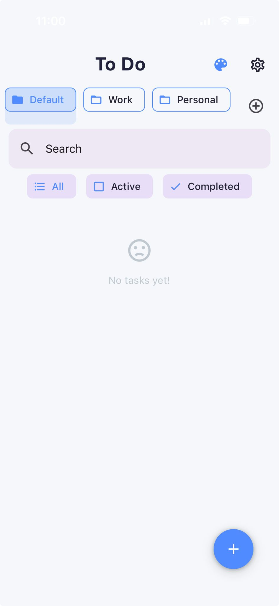

# 📲 JustTask

**FocusList is a simple and modern To-Do app built with React Native and Expo.**  
It helps you keep track of your tasks, set reminders, and stay organized—all without any extra fuss.

---

## 🖼️ Screenshot

---

## How to use

1. Clone this repo.
2. Run `npm install` to get all the dependencies.
3. Start the app with `npm start`.
4. Open it in Expo Go on your phone, or use an Android/iOS emulator.

## Features

- Make multiple lists (Work, Personal, and more)
- Add, edit, delete tasks
- Set reminders and due dates for anything
- Fast search and filters (All, Active, Completed)
- Swipe to complete or delete tasks
- Toggle light and dark mode any time
- Offline-first: your data stays on your device

## Tech used

- React Native & Expo for building the app
- React Native Paper for the modern UI
- AsyncStorage for local data
- date-fns for date and time handling

## Why JustTask?

Because you shouldn’t have to wrestle with your to-do app. This one is fast, clean, and distraction-free. No signups, no ads, just a simple way to keep your life on track.

## License

MIT — free to use, remix, and share.

_by Utkarsh Panchal_
